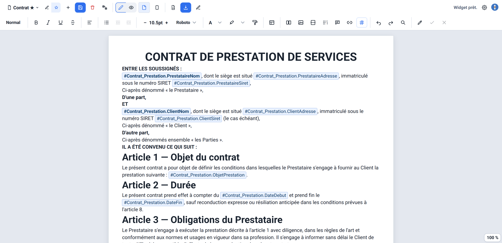
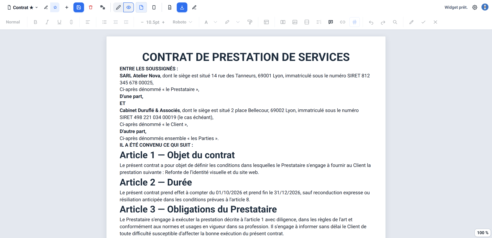

# Publipostage+ pour Grist

*🇬🇧 An English version of this document is available [at the bottom of this page](#publipostage-for-grist).*

> **Version bêta {{VERSION}}**, publiée le {{DATE_FR}}. Les fonctions décrites ci-dessous sont livrées,
> mais des défauts peuvent subsister : essayez le widget sur une copie de votre document avant de
> l'utiliser sur des données importantes. Les [limites connues](#limites-connues) et la
> [roadmap](#roadmap) disent ce qui manque encore.

Il s'agit d'un éditeur de texte avec publipostage et puces intelligentes. Il permet à n'importe qui de
rédiger des contrats, factures ou étiquettes sans écrire la moindre ligne de code, tout en pouvant
référencer une variable de n'importe quelle table du document et la reformater à l'affichage si
nécessaire !

C'est un widget personnalisé pour [Grist](https://www.getgrist.com/), conçu par
[Grist Factory](https://grist-factory.fr). Un document se lit rempli avec les données d'une ligne,
puis se télécharge en PDF vectoriel (texte sélectionnable), en Word ou en Excel, ou s'envoie dans un
e-mail prérempli, ligne par ligne ou en lot.

## Aperçu

| Mode édition | Mode lecture |
|---|---|
|  |  |

## Sommaire

- [Fonctionnalités](#fonctionnalités)
- [Installation dans Grist](#installation-dans-grist)
- [Configuration](#configuration)
- [Sécurité et permissions](#sécurité-et-permissions)
- [Dépendances](#dépendances)
- [Limites connues](#limites-connues)
- [Note sur l'IA](#note-sur-lia)
- [Roadmap](#roadmap)
- [Contribuer](#contribuer)
- [Licence](#licence)

Moteur d'édition : [TipTap](https://tiptap.dev/)/ProseMirror. Le widget est une simple page statique
hébergée sur GitHub Pages, sans backend ni étape de build.

## Fonctionnalités

**Quatre types de modèles**
- Document : texte riche sur une page A3, A4, A5 ou A6, en portrait ou en paysage, avec des marges
  réglables par modèle
- E-mail : objet, destinataires et corps avec les mêmes variables, ouvert dans votre messagerie par un
  lien `mailto:`
- Grille : un tableau de type tableur à la place de la page, où l'on peut coller un tableau d'Excel, de
  Google Sheets ou de LibreOffice Calc, importer un classeur `.xlsx`, puis l'exporter en Excel
- Macro-modèle : une page de garde toujours incluse, suivie d'annexes (d'autres modèles) choisies selon
  des règles évaluées sur la même ligne

**Mise en page**
- Mise en forme complète : gras, italique, souligné, barré, couleurs et surlignage, six polices en
  tailles réelles de 8 à 72 points, alignement et retraits, titres numérotés, pinceau de mise en forme
- Listes à puces, numérotées et de tâches à cocher
- Tableaux (fusion et scission de cases, fond de case, légende), zones 2 colonnes
- Images, y compris flottantes (habillage de texte, calque devant ou derrière, opacité, légende),
  collées, ajoutées par adresse ou prises dans une colonne Pièces jointes de Grist ; une image
  hébergée sur un autre site n'apparaît qu'après un clic sur « Afficher »
- En-têtes et pieds de page (première page différente, numéro de page), notes de bas de page, sommaire
  généré, sauts de page, filigrane
- Citation, bloc de code, encadré (Note, Attention, Important), bloc de signature, QR code, graphique de la
  page (un graphique réglé dans Grist, redessiné dans le document)
- Rechercher / remplacer, abréviations qui se développent à la frappe
- Aperçu « format A4 » fidèle, WYSIWYG (ce que vous voyez est ce que vous obtenez)
- Zoom de la page à l'écran, en Édition comme en Lecture (pastille du coin, Ajuster, Ctrl + molette) : le
  PDF, le Word et l'impression gardent les dimensions réelles

**Variables Grist intelligentes**
- Autocomplétion `#Table.Colonne` sur toutes les tables du document, avec une clé de correspondance à
  configurer une fois pour les tables liées
- Mise en forme sur mesure des nombres (écriture française ou américaine, décimales, devise, en toutes
  lettres), des dates (formats prédéfinis, en toutes lettres) et des Oui/Non (texte ou case cochée)
- Puces intelligentes (date du jour, heure, e-mail de la personne connectée) et calculs (SOMME,
  MOYENNE, MIN, MAX, NB, ARRONDI)
- Conditions d'affichage (variable, bloc de texte, valeur dans la phrase, case cochée) et boucles sur
  les lignes liées (ligne de tableau, élément de liste, paragraphe), avec filtre, tri et séparateurs
- Renommages suivis : quand une table ou une colonne est renommée dans Grist, les modèles suivent

**Lecture, enregistrement et collaboration**
- Mode lecture (le document rempli avec la ligne sélectionnée) et lecture épurée, sans barre d'outils
- Enregistrement automatique avec détection d'un conflit si quelqu'un d'autre a enregistré le modèle
  entre-temps
- Commentaires sur le texte sélectionné, avec réponses et résolution, partagés entre les personnes qui
  ouvrent le document
- Suivi des modifications (bêta) : les changements sont proposés dans le texte, puis acceptés ou
  refusés un par un ou tous ensemble ; la barre Accepter / Refuser dit qui a proposé la modification
  (son nom, à défaut son adresse e-mail)
- Droits par personne (lecture seule, export, commentaires), lus dans une table du document
- Rangement personnel des modèles : épingles et dossiers que les autres personnes ne voient pas

**Export PDF, Word, Excel**
- Export en PDF vectorisé, nom de fichier composé avec des variables
- Export en lot en un clic : un PDF par ligne dans une archive ZIP, ou toutes les lignes dans un seul
  PDF. Il suit les lignes que le widget affiche dans Grist (ses filtres, son tri, le lien « Sélectionner
  par ») : quand il n'en affiche qu'une partie, il demande s'il faut exporter celles-ci ou toute la table
- Assemblage avant impression : les pages de chaque ligne posées sur des feuilles A4 ou A3, avec ou
  sans traits de coupe, et une marge réglable autour de chaque page (quatre A6 sur une A4, par exemple)
- Word (`.docx`, bêta) et Excel (`.xlsx`, pour les grilles)
- Avant un export, une fenêtre liste les sites externes dont des images seraient téléchargées

**Modèles**
- Gestion multi-modèles, sauvegardés directement dans le document Grist
- Galerie de modèles prêts à l'emploi : facture, contrat de prestation de services, attestation,
  courrier de relance (voir l'[avertissement](#limites-connues) à leur sujet)

**Autres**
- Interface bilingue français/anglais, thème clair, sombre ou celui du système
- 54 raccourcis clavier personnalisables
- Choix de la touche utilisée pour déclencher les variables (`#` par défaut)
- Barre d'outils pensée pour un petit panneau (testée à 700×400)

## Installation dans Grist

1. Dans une page Grist, ajoutez un widget personnalisé et collez cette URL :
   **`https://grist-factory.github.io/Publipostage-Plus/`**
   (toute copie de ce dépôt hébergée en HTTPS sur un serveur statique convient aussi)
2. Dans le panneau de configuration du widget, réglez **Select by** (« Sélectionner par ») sur la
   table dont les lignes serviront de source de données. C'est ce réglage qui permet au widget de
   suivre la ligne sélectionnée : sans lui, le mode lecture n'a pas de ligne à résoudre.
3. Grist demande une autorisation d'accès au chargement du widget (voir
   [Sécurité et permissions](#sécurité-et-permissions) plus bas) : elle est nécessaire au bon
   fonctionnement du widget.
4. Au premier lancement dans un document, le widget demande s'il peut y créer ses tables internes
   `Publipostage_*` (« Créer les tables du widget dans ce document ? ») : il faut donc avoir le droit de
   le modifier. Refusé, rien n'est créé ni enregistré, et la question revient à l'action suivante. Leurs
   pages sont rangées sous celle des modèles, repliée.
5. Après une mise à jour du widget, rechargez la page du document Grist, sans quoi le navigateur peut
   garder l'ancienne version.

Ouvert seul dans un onglet du navigateur, le widget ne fonctionne pas : il le dit et rappelle ces étapes.

**Premiers pas** : ouvrez le menu « Nouveau modèle » puis « Nouveau document » (ou « Créer à partir
d'un modèle… » pour partir de la galerie), écrivez le texte et tapez `#` pour insérer une variable.
Passez en mode lecture pour voir le document rempli avec la ligne sélectionnée, puis exportez-le.

## Configuration

- **Créer ou éditer un modèle** : bouton "Nouveau modèle", ou sélecteur de modèle en haut de
  l'éditeur. Chaque modèle est stocké dans une table Grist interne, créée avec votre accord (préfixée
  `Publipostage_`), qui n'apparaît pas dans les sélecteurs de table habituels.
- **Variables d'une autre table** : le panneau `#` propose un bouton dédié (« Tables liées ») pour
  configurer une fois pour toutes la correspondance entre deux tables (la « clé de correspondance »),
  valable pour tous les modèles du document.
- **En-tête et pied de page** : cliquez sur une marge en haut ou en bas de la page pour entrer dans
  l'édition dédiée.
- **Réglages** (bouton de la barre du haut) : langue (celle du navigateur au premier lancement), thème, touche déclenchant le panneau `#`,
  raccourcis clavier, marges du modèle, modèle par défaut de la vue, droits par personne, crédits.
  Les réglages « Vue » et « Accès » sont des options du widget : Grist ne les partage avec les autres
  personnes qu'une fois la vue enregistrée.
- **Nom du fichier PDF** : champ dédié, qui accepte lui aussi des variables.

## Sécurité et permissions

Le widget demande le niveau d'accès `requiredAccess: 'full'`, c'est-à-dire un accès à l'ensemble du
document Grist et pas seulement à la table à laquelle il est lié. Ce niveau est nécessaire dans
l'architecture actuelle : la résolution de variables vers une autre table, l'autocomplétion sur tout le
document et la gestion des tables internes du widget en ont besoin dès le chargement. L'API des widgets
personnalisés Grist ne propose pas de niveau intermédiaire entre l'accès à une seule table et l'accès
complet.

Cet accès s'applique au widget, pas directement à chaque utilisateur : les Règles d'accès natives de
Grist, configurées sur le document par son propriétaire, continuent de s'appliquer normalement. Un
utilisateur restreint à certaines tables ou colonnes le reste en utilisant le widget. C'est donc au
niveau du document Grist lui-même que doit se faire une éventuelle restriction fine des données, pas
dans la configuration du widget. Les « droits par personne » du widget (Réglages > Accès) ne sont qu'un
verrou d'interface : ils grisent des commandes, ils ne protègent aucune donnée.

Le widget écrit dans sept tables du document, toutes préfixées `Publipostage_` : `Publipostage_Modeles`
(les modèles, et une ligne « Réglages du document » qui garde les couleurs partagées par tous les
modèles), `Publipostage_Commentaires`, `Publipostage_PreferencesModeles` (épingles et dossiers de
chaque personne), `Publipostage_Abreviations`, `Publipostage_FormatsPage`, `Publipostage_LiensTables`
(les clés de correspondance entre tables) et `Publipostage_UserProbe` (qui sert à lire l'e-mail de la
personne connectée). Il ne les crée qu'avec l'accord de la personne : avant la première création, une
fenêtre demande « Créer les tables du widget dans ce document ? » (« Créer les tables » ou « Ne pas
créer »). Un oui vaut jusqu'à la fermeture de la page ; un refus n'écrit rien, n'est jamais gardé, et la
question revient à l'action suivante de la personne. Un document qui porte déjà une table du widget ne
pose aucune question.

Le widget charge des bibliothèques tierces à l'exécution, depuis `esm.sh` (moteur d'édition
TipTap/ProseMirror), `cdnjs.cloudflare.com` et `cdn.jsdelivr.net` (exports PDF, Word, Excel, QR
code et graphique de la page, chargés au premier usage) et `docs.getgrist.com` (API de Grist), à des versions figées, sauf le
script de l'API de Grist, que Grist sert dans sa version courante. Les fichiers venant de `cdnjs` et
de `jsDelivr` sont protégés par une intégrité SRI, qui empêche le navigateur d'exécuter un fichier
altéré ; ce n'est techniquement pas possible pour l'import map `esm.sh`. Aucune police ni feuille de
style ne vient d'un autre site.

La page porte une politique de sécurité du contenu (CSP) : seuls s'exécutent les scripts du widget,
ceux des adresses ci-dessus et trois scripts en ligne cités par leur empreinte. Les gestionnaires
d'événements en ligne, les adresses `javascript:`, les cadres, les objets et les formulaires sont
refusés. `'unsafe-eval'` y reste faute de mieux : le script d'API que sert Grist en a besoin. Le
HTML d'un modèle relu depuis le document, qu'une autre personne a pu modifier, est assaini avant
d'être affiché, et les formules de calcul ne passent jamais par `eval`. Les images et les connexions ne
sont pas limitées par la CSP : le widget lit des images et des pièces jointes de n'importe quel site.
Mais une image hébergée sur un autre site que le widget ou Grist ne se charge qu'après un clic sur
« Afficher » (dans l'éditeur, la Lecture, les en-têtes et pieds de page et la galerie), car la charger
apprend à ce site l'adresse IP de la personne et l'heure d'ouverture du document : le clic affiche toutes
les images de ce site jusqu'à la fermeture de la page, et rien n'est retenu, ni dans le navigateur ni dans
le document. Avant un export qui téléchargerait de telles images, une fenêtre liste les sites et demande
confirmation.

Aucune donnée n'est stockée hors de Grist. Les seules informations conservées dans le navigateur
(`localStorage`) sont des préférences d'interface (langue, thème, touches, raccourcis et vue de leur
panneau, état de l'enregistrement automatique, dernier choix de l'assemblage avant impression), le niveau
de zoom de la page des derniers modèles ouverts (avec leur numéro et leur nom) et, pour suivre les
renommages, les noms des tables et des colonnes de chaque document ouvert, jamais de donnée de ligne.

Pour signaler une vulnérabilité, merci de ne pas ouvrir d'issue publique : suivez
[SECURITY.md](SECURITY.md).

## Dépendances

Aucune étape de build : tous les fichiers sont servis tels quels. Les bibliothèques tierces sont
chargées à l'exécution, à des versions toujours figées (sauf le script de l'API de Grist) :

| Bibliothèque | Usage | Origine |
|---|---|---|
| `grist-plugin-api.js` | API du widget Grist (obligatoire) | `docs.getgrist.com` |
| TipTap 3.31.3 + ProseMirror (une quinzaine de paquets) + `@floating-ui/dom` 1.6.12 | Moteur d'édition riche | `esm.sh` |
| `@handlewithcare/prosemirror-suggest-changes` 0.1.8 | Suivi des modifications | `esm.sh` |
| pdfmake 0.2.7 + `vfs_fonts` | Export PDF vectoriel | `cdnjs.cloudflare.com` |
| pdf-lib 1.17.1 | Un seul PDF pour toutes les lignes, assemblage avant impression | `cdnjs.cloudflare.com` |
| JSZip 3.10.1 | Export en lot (archive zip) | `cdnjs.cloudflare.com` |
| ExcelJS 4.4.0 | Export Excel | `cdnjs.cloudflare.com` |
| qrcode-generator 1.4.4 | QR code | `cdnjs.cloudflare.com` |
| docx 9.7.1 | Export Word | `cdn.jsdelivr.net` |
| Plotly.js 2.13.2 (`plotly.js-basic-dist-min`) | Graphique de la page | `cdn.jsdelivr.net` |

L'interface prend la police du système. Les polices des documents sont dans le dépôt : Roboto pour
l'éditeur, et pour le PDF Roboto, Arimo, Tinos, Cousine, Gelasio et Carlito, les équivalents libres de
même métrique d'Arial, Times New Roman, Courier New, Georgia et Calibri. Les licences de toutes ces
bibliothèques et polices sont dans [NOTICE](NOTICE).

## Limites connues

- **Accès complet au document** : faute de niveau intermédiaire dans Grist, le widget demande
  `requiredAccess: 'full'` (voir [Sécurité et permissions](#sécurité-et-permissions)). Il n'existe pas
  de version avec les dépendances embarquées, pour éviter tout appel externe.
- **Réseau** : `esm.sh` (éditeur) et `docs.getgrist.com` (API de Grist) sont nécessaires au démarrage ;
  `cdnjs.cloudflare.com` et `cdn.jsdelivr.net` le sont au premier export ou au premier graphique de la
  page. Un pare-feu qui bloque l'un d'eux empêche le widget de démarrer ou l'export de se faire : il faut
  les autoriser. Au démarrage, le widget le dit dans une fenêtre qui liste ces adresses.
- **Audit externe** : un audit du code (outil gwaudit, 4 octobre 2026) conclut « NON CONFORME » et compte
  69 points bloquants. Tous tiennent à un seul choix : l'éditeur (TipTap et ProseMirror) se charge depuis
  `esm.sh`, un site tiers, sans intégrité SRI (ce qu'un import map ne permet pas ; voir
  [Dépendances](#dépendances)). Ce choix est gardé pour la bêta, donc le verdict reste « NON CONFORME », et
  l'outil en tire qu'un hébergement sur une instance officielle (DINUM, ANCT) est exclu en l'état. Le
  widget reste installable ailleurs : à chaque personne de juger si ce risque convient à son usage.
- **Navigateurs** : les tests automatisés tournent sur Chromium (Chrome, Edge), avec un simulateur de
  Grist ; Firefox et Safari ne sont pas testés automatiquement.
- **Enregistrement** : deux personnes qui modifient le même modèle en même temps ne sont pas fusionnées.
  L'enregistrement automatique détecte qu'une autre personne a enregistré entre-temps et propose de
  recharger la dernière version ; le bouton « Enregistrer » écrase la version enregistrée sans le
  vérifier. Il n'y a pas de co-édition en temps réel.
- **Suivi des modifications** (bêta) : la version complète est prévue en V1.
- **PDF** : les caractères chinois, arabes, hébreux, thaï et la plupart des émojis ne sont pas pris en
  charge (une case vide les remplace) ; le grec, le cyrillique, le vietnamien, les flèches, coches,
  étoiles et monnaies le sont. Dans le menu « Qualité d'export PDF », seule l'option « Vectoriel » est
  disponible : « Impr. navigateur », « Basse qualité » et « Ultra HD » sont grisées (« bientôt »).
- **Word** (bêta) : les images devant ou derrière le texte et celles alignées à gauche ou à droite y
  gardent leur place, le sommaire est une liste fixe et les polices ne sont pas embarquées.
- **E-mail** : le corps est du texte brut (l'éditeur d'un modèle e-mail n'écrit ni gras, ni couleur, ni
  niveau de titre, ni image : le texte du lien a les lignes de l'éditeur), sans pièce jointe ; le lien
  `mailto:` est limité à environ 2 000 caractères, une jauge prévient quand il les dépasse.
- **Excel** : le fichier contient des valeurs, jamais de formule.
- **Accessibilité** : pas d'audit RGAA complet à ce jour ; les contrastes, le focus et les fenêtres
  (Tab, Échap) ont été travaillés.
- **Droits par personne** : un verrou d'interface, pas une protection des données (voir
  [Sécurité et permissions](#sécurité-et-permissions)).
- **Modèles de la galerie** : ce sont des exemples de mise en page, écrits pour le droit français. Ils
  ne constituent ni un avis ni un conseil juridique et ne sont pas garantis conformes à la loi en
  vigueur (mentions obligatoires, pénalités de retard, clauses…) : faites-les relire avant tout usage.
- **Pas encore faits** : remplissage d'un modèle avec des données d'exemple, variantes multilingues
  d'un modèle, codes-barres (le QR code est livré), export et import Markdown.

## Note sur l'IA

Ce widget a été réalisé avec l'aide de Claude Code, avec le modèle Claude Sonnet 5 en mode Ultra Code.
Le code a été relu par un humain (moi), mais je manque de tokens pour être aussi efficace que Claude.

La version Bêta sera aussi l'occasion de corriger ou refacto certains éléments si nécessaire : le
dépôt est ouvert à la collaboration (cf. ci-après).

## Roadmap

De nombreuses fonctionnalités sont prévues et seront ajoutées progressivement dans les prochaines
semaines. N'hésitez pas à réagir aux issues de ce dépôt, ou à m'écrire sur Tchap, pour m'aider à les
prioriser.

**Édition collaborative**
- Suivi des modifications : version complète (V1)

**Édition augmentée**
- Codes-barres, en plus du QR code (V1)
- Remplissage d'un modèle avec des données d'exemple, pour le prévisualiser sans ligne réelle
- Modèles multilingues : variantes d'un même modèle (V1)

**Import / Export**
- Export Markdown (V1)
- Import Markdown, avec une fiabilité totale sur les imports depuis Docs de La Suite (V1)
- Export PDF : impression navigateur, impression full HD, PDF compressé (V1)

**Confort d'utilisation**
- Optimisation du chargement (V1)

**Sécurité**
- Version lecture seule : préparer un modèle sur Docs, puis exporter/importer pour une session en
  lecture seule, avant export (V1)

## Contribuer

Les contributions sont bienvenues : signaler un défaut, proposer une fonction, envoyer une correction.
Commencez par [CONTRIBUTING.md](CONTRIBUTING.md) ; le [code de conduite](CODE_OF_CONDUCT.md) s'applique à
tous les échanges. Pour vous repérer dans le code (quel fichier fait quoi, par où commencer), lisez la
[carte du code](CARTE_DU_CODE.md). Les changements de chaque version sont dans
[CHANGELOG.md](CHANGELOG.md).

## Licence

Ce projet est distribué sous licence [GNU General Public License v3.0](LICENSE) (GPLv3).

Copyright (C) 2026 Grist Factory

Les bibliothèques et les polices tierces gardent leurs propres licences : voir [NOTICE](NOTICE).
« Grist » est un produit de Grist Labs ; Publipostage+ est un widget tiers, qui n'est pas publié par
Grist Labs.

---
---

# Publipostage+ for Grist

*🇫🇷 Une version française de ce document est disponible [en haut de cette page](#publipostage-pour-grist).*

> **Beta version {{VERSION}}**, released on {{DATE_EN}}. The features described below are delivered,
> but defects may remain: try the widget on a copy of your document before using it on important data.
> The [known limitations](#known-limitations) and the [roadmap](#roadmap-1) say what is still missing.

This is a text editor with mail merge and smart chips. It lets anyone write contracts, invoices or
labels without writing a single line of code, while being able to reference a variable from any table
in the document and reformat it on display if needed!

It is a custom widget for [Grist](https://www.getgrist.com/), made by
[Grist Factory](https://grist-factory.fr). A document is read filled with the data of one row, then
downloaded as a vector PDF (selectable text), as Word or Excel, or sent in a pre-filled e-mail, row by
row or in batch.

## Preview

| Editing mode | Reading mode |
|---|---|
|  |  |

## Table of contents

- [Features](#features)
- [Installing in Grist](#installing-in-grist)
- [Configuration](#configuration-1)
- [Security and permissions](#security-and-permissions)
- [Dependencies](#dependencies)
- [Known limitations](#known-limitations)
- [A note on AI](#a-note-on-ai)
- [Roadmap](#roadmap-1)
- [Contributing](#contributing)
- [License](#license)

Editing engine: [TipTap](https://tiptap.dev/)/ProseMirror. The widget is a plain static page hosted on
GitHub Pages, with no backend and no build step.

## Features

**Four template types**
- Document: rich text on an A3, A4, A5 or A6 page, portrait or landscape, with margins you can set per
  template
- E-mail: subject, recipients and body with the same variables, opened in your mail client through a
  `mailto:` link
- Grid: a spreadsheet-like table in place of the page, where you can paste a table from Excel, Google
  Sheets or LibreOffice Calc, import an `.xlsx` workbook, then export it to Excel
- Macro template: a cover page that is always included, followed by appendices (other templates) chosen
  by rules evaluated on the same row

**Layout**
- Full formatting: bold, italic, underline, strikethrough, colors and highlighting, six fonts in real
  point sizes from 8 to 72, alignment and indents, numbered headings, format painter
- Bullet lists, numbered lists and checkable task lists
- Tables (merging and splitting cells, cell background, caption), two-column zones
- Images, including floating ones (text wrap, layered in front of/behind, opacity, caption), pasted,
  added by address or taken from a Grist Attachments column; an image hosted on another site only
  appears after a click on "Show"
- Headers and footers (different first page, page number), footnotes, generated table of contents,
  page breaks, watermark
- Quote, code block, callout (Note, Warning, Important), signature block, QR code, chart from the page (a
  chart set up in Grist, redrawn in the document)
- Find / replace, abbreviations that expand as you type
- Faithful "A4 format" preview, WYSIWYG (what you see is what you get)
- On-screen page zoom, in Edit and Reading modes (corner pill, Fit, Ctrl + wheel): the PDF, the Word file
  and printing keep the real dimensions

**Smart Grist variables**
- `#Table.Column` autocomplete across every table in the document, with a matching key to set up once
  for linked tables
- Tailored formatting for numbers (French or US notation, decimals, currency, spelled out), dates
  (predefined formats, spelled out) and Yes/No values (text or checked box)
- Smart chips (today's date, time, connected user's e-mail) and calculations (SUM, AVERAGE, MIN, MAX,
  COUNT, ROUND)
- Display conditions (variable, text block, value in a sentence, checked box) and loops over linked
  rows (table row, list item, paragraph), with filter, sort and separators
- Tracked renames: when a table or a column is renamed in Grist, templates follow

**Reading, saving and collaboration**
- Reading mode (the document filled with the selected row) and clean reading, without the toolbar
- Autosave with conflict detection if someone else saved the template in the meantime
- Comments on the selected text, with replies and resolution, shared between the people who open the
  document
- Track changes (beta): changes are proposed in the text, then accepted or rejected one by one or all
  together; the Accept / Reject bar says who proposed the change (their name, or their e-mail address
  when there is no name)
- Per-person rights (read-only, export, comments), read from a table of the document
- Personal organization of templates: pins and folders that other people don't see

**PDF, Word, Excel export**
- Vector PDF export, file name built with variables
- Batch export in one click: one PDF per row in a ZIP archive, or all rows in a single PDF. It follows
  the rows the widget shows in Grist (its filters, its sort, the "Select by" link): when it only shows
  part of the table, it asks whether to export those or the whole table
- Sheet assembly before printing: each row's pages laid out on A4 or A3 sheets, with or without crop
  marks, and an adjustable margin around each page (four A6 on one A4, for example)
- Word (`.docx`, beta) and Excel (`.xlsx`, for grids)
- Before an export, a window lists the external sites that images would be downloaded from

**Templates**
- Multi-template management, saved directly in the Grist document
- Gallery of ready-to-use templates: invoice, service agreement, certificate, payment reminder letter
  (see the [warning](#known-limitations) about them)

**Other**
- Bilingual French/English interface, light, dark or system theme
- 54 customizable keyboard shortcuts
- Choice of key used to trigger variables (`#` by default)
- Toolbar designed for a small panel (tested at 700×400)

## Installing in Grist

1. In a Grist page, add a custom widget and paste this URL:
   **`https://grist-factory.github.io/Publipostage-Plus/`**
   (any copy of this repository hosted over HTTPS on a static server works too)
2. In the widget's configuration panel, set **Select by** to the table whose rows will be the data
   source. This is what lets the widget follow the selected row: without it, reading mode has no row to
   resolve against.
3. Grist will ask for an access permission when the widget loads (see
   [Security and permissions](#security-and-permissions) below): granting it is required for the widget
   to work.
4. On first launch in a document, the widget asks whether it may create its internal `Publipostage_*`
   tables there ("Create the widget’s tables in this document?"), so you need the right to edit it. If
   you decline, nothing is created or saved, and the question comes back at your next action. Their pages
   are filed under the templates page, collapsed.
5. After a widget update, reload the Grist document's page, otherwise the browser may keep the old
   version.

Opened alone in a browser tab, the widget does not work: it says so and recalls these steps.

**Getting started**: open the "New template" menu then "New document" (or "Create from a template…" to
start from the gallery), write the text and type `#` to insert a variable. Switch to reading mode to
see the document filled with the selected row, then export it.

## Configuration

- **Create or edit a template**: the "New template" button, or the template picker at the top of the
  editor. Each template is stored in an internal Grist table, created with your consent (prefixed
  `Publipostage_`), which doesn't show up in the usual table pickers.
- **Variables from another table**: the `#` panel has a dedicated button ("Linked tables") to set up the
  relationship between two tables once, for good (the "matching key"), valid for every template in the
  document.
- **Header and footer**: click a margin at the top or bottom of the page to enter dedicated editing.
- **Settings** (button in the top bar): language (the browser's at first launch), theme, the key that triggers the `#` panel, keyboard
  shortcuts, the template's margins, the view's default template, per-person rights, credits. The
  "View" and "Access" settings are widget options: Grist only shares them with other people once the
  view is saved.
- **PDF file name**: its own field, which also accepts variables.

## Security and permissions

The widget requests `requiredAccess: 'full'`, meaning access to the whole Grist document rather than
just the table it's linked to. This is needed by the current architecture: resolving variables from
another table, autocompleting across the whole document, and managing the widget's own internal tables
all need it from the moment the widget loads. Grist's custom widget API doesn't offer a middle ground
between single-table access and full access.

This access applies to the widget, not directly to each user: Grist's native Access Rules, set on the
document by its owner, still apply as normal. A user restricted to certain tables or columns stays
restricted while using the widget. Any fine-grained restriction of the data should therefore happen at
the Grist document level, not in the widget's configuration. The widget's "per-person rights"
(Settings > Access) are only an interface lock: they grey out commands, they don't protect any data.

The widget writes to seven tables of the document, all prefixed `Publipostage_`: `Publipostage_Modeles`
(the templates, and a "Réglages du document" row that keeps the colors shared by every template),
`Publipostage_Commentaires`, `Publipostage_PreferencesModeles` (each person's pins and
folders), `Publipostage_Abreviations`, `Publipostage_FormatsPage`, `Publipostage_LiensTables` (the
matching keys between tables) and `Publipostage_UserProbe` (used to read the connected user's e-mail). It
only creates them with the person's consent: before the first creation, a window asks "Create the
widget’s tables in this document?" ("Create the tables" or "Don’t create"). A yes holds until the page
is closed; a refusal writes nothing, is never remembered, and the question comes back at the person's
next action. A document that already has one of the widget's tables is never asked.

The widget loads third-party libraries at runtime, from `esm.sh` (the TipTap/ProseMirror editing
engine), `cdnjs.cloudflare.com` and `cdn.jsdelivr.net` (PDF, Word, Excel, QR code and chart from the page, loaded on first
use) and `docs.getgrist.com` (the Grist API), at pinned versions, except the Grist API script, which
Grist serves in its current version. Files from `cdnjs` and `jsDelivr` are protected by SRI integrity
hashes, which stop the browser from running a tampered file; this isn't technically possible for the
`esm.sh` import map. No font or stylesheet comes from another site.

The page carries a Content Security Policy (CSP): only the widget's own scripts, those of the addresses
above and three inline scripts cited by their hash are allowed to run. Inline event handlers,
`javascript:` addresses, frames, objects and forms are refused. `'unsafe-eval'` remains for lack of a
better option: the API script that Grist serves needs it. The HTML of a template read back from the
document, which another person may have edited, is sanitized before being displayed, and calculation
formulas never go through `eval`. Images and connections are not limited by the CSP: the widget reads
images and attachments from any site. Still, an image hosted on a site other than the widget's or
Grist's only loads after a click on "Show" (in the editor, Reading mode, headers and footers and the
gallery), because loading it tells that site the person's IP address and when the document was opened:
the click shows every image from that site until the page is closed, and nothing is remembered, neither
in the browser nor in the document. Before an export that would download such images, a window lists the
sites and asks for confirmation.

No data is ever stored outside of Grist. The only things kept in the browser (`localStorage`) are
interface preferences (language, theme, keys, shortcuts and the view of their panel, autosave state, last
choice in the sheet assembly before printing), the page zoom level of the last templates opened (with
their number and name) and, to follow renames, the names of the tables and columns of each open
document, never any row data.

To report a vulnerability, please don't open a public issue: follow [SECURITY.md](SECURITY.md).

## Dependencies

No build step: every file is served as-is. Third-party libraries are loaded at runtime, always at
pinned versions (except the Grist API script):

| Library | Purpose | Source |
|---|---|---|
| `grist-plugin-api.js` | Grist widget API (required) | `docs.getgrist.com` |
| TipTap 3.31.3 + ProseMirror (about fifteen packages) + `@floating-ui/dom` 1.6.12 | Rich text editing engine | `esm.sh` |
| `@handlewithcare/prosemirror-suggest-changes` 0.1.8 | Track changes | `esm.sh` |
| pdfmake 0.2.7 + `vfs_fonts` | Vector PDF export | `cdnjs.cloudflare.com` |
| pdf-lib 1.17.1 | Single PDF for all rows, sheet assembly before printing | `cdnjs.cloudflare.com` |
| JSZip 3.10.1 | Batch export (zip archive) | `cdnjs.cloudflare.com` |
| ExcelJS 4.4.0 | Excel export | `cdnjs.cloudflare.com` |
| qrcode-generator 1.4.4 | QR code | `cdnjs.cloudflare.com` |
| docx 9.7.1 | Word export | `cdn.jsdelivr.net` |
| Plotly.js 2.13.2 (`plotly.js-basic-dist-min`) | Chart from the page | `cdn.jsdelivr.net` |

The interface uses the system font. The documents' fonts are in the repository: Roboto for the editor,
and for the PDF Roboto, Arimo, Tinos, Cousine, Gelasio and Carlito, the free metric-compatible
equivalents of Arial, Times New Roman, Courier New, Georgia and Calibri. The licenses of all these
libraries and fonts are in [NOTICE](NOTICE).

## Known limitations

- **Full access to the document**: for lack of a middle level in Grist, the widget requests
  `requiredAccess: 'full'` (see [Security and permissions](#security-and-permissions)). There is no
  version with bundled dependencies to avoid any external call.
- **Network**: `esm.sh` (editor) and `docs.getgrist.com` (Grist API) are needed at startup;
  `cdnjs.cloudflare.com` and `cdn.jsdelivr.net` are needed at the first export or the first chart from the
  page. A firewall that blocks one of them prevents the widget from starting or the export from working:
  they must be allowed. At startup, the widget says so in a window that lists these addresses.
- **External audit**: an audit of the code (gwaudit tool, October 4, 2026) concludes "NON CONFORME"
  (non-compliant) and counts 69 blocking points. They all come down to one choice: the editor (TipTap and
  ProseMirror) is loaded from `esm.sh`, a third-party site, without an SRI integrity hash (which an import
  map doesn't allow; see [Dependencies](#dependencies)). That choice is kept for the beta, so the verdict
  stays "NON CONFORME", and the tool concludes that hosting the widget on an official instance (DINUM,
  ANCT) is ruled out as it stands. The widget remains installable elsewhere: it is up to each person to
  judge whether this risk suits their use.
- **Browsers**: automated tests run on Chromium (Chrome, Edge), with a Grist simulator; Firefox and
  Safari are not tested automatically.
- **Saving**: two people editing the same template at the same time are not merged. Autosave detects
  that someone else saved in the meantime and offers to reload the latest version; the "Save" button
  overwrites the saved version without checking. There is no real-time co-editing.
- **Track changes** (beta): the complete version is planned for V1.
- **PDF**: Chinese, Arabic, Hebrew and Thai characters and most emoji are not supported (an empty box
  replaces them); Greek, Cyrillic, Vietnamese, arrows, check marks, stars and currencies are. In the
  "PDF export quality" menu, only the "Vector" option is available: "Browser print", "Low quality" and
  "Ultra HD" are greyed out ("soon").
- **Word** (beta): images in front of or behind the text, and images aligned left or right, keep their
  place; the table of contents is a fixed list and fonts are not embedded.
- **E-mail**: the body is plain text (the editor of an e-mail template writes no bold, colour, heading level or
  image: the text of the link has the editor's lines), with no attachment; the `mailto:` link is limited to about
  2,000 characters, and a gauge warns when it goes over.
- **Excel**: the file holds values, never formulas.
- **Accessibility**: no full RGAA audit to date; contrasts, focus and windows (Tab, Esc) have been worked
  on.
- **Per-person rights**: an interface lock, not data protection (see
  [Security and permissions](#security-and-permissions)).
- **Gallery templates**: these are layout examples, written for French law. They are neither legal
  advice nor guaranteed to comply with current law (mandatory mentions, late-payment penalties,
  clauses…): have them reviewed before any real use.
- **Not done yet**: filling a template with sample data, multilingual variants of a template,
  barcodes (the QR code is delivered), Markdown export and import.

## A note on AI

This widget was built with the help of Claude Code, using the Claude Sonnet 5 model in Ultra Code mode.
The code was reviewed by a human (me), but I don't have enough tokens to be as thorough as Claude.

The Beta release will also be a chance to fix or refactor certain parts if needed: this repository is
open to collaboration (see below).

## Roadmap

Plenty of features are planned and will be rolled out gradually over the coming weeks. Feel free to
react to this repository's issues, or write to me on Tchap, to help me prioritize them.

**Collaborative editing**
- Track changes: complete version (V1)

**Enhanced editing**
- Barcodes, in addition to the QR code (V1)
- Filling a template with sample data, to preview it without a real row
- Multilingual templates: variants of the same template (V1)

**Import / export**
- Markdown export (V1)
- Markdown import, with full reliability on imports from La Suite Docs (V1)
- PDF export: browser print, full HD print, compressed PDF (V1)

**Quality of life**
- Loading time optimization (V1)

**Security**
- Read-only version: prepare a template in Docs, then export/import for a read-only session, before
  exporting (V1)

## Contributing

Contributions are welcome: reporting a defect, suggesting a feature, sending a fix. Start with
[CONTRIBUTING.md](CONTRIBUTING.md); the [code of conduct](CODE_OF_CONDUCT.md) applies to every exchange.
To find your way around the code (which file does what, where to start), read the
[code map](CARTE_DU_CODE.md#publipostage-code-map). The changes of each version are in
[CHANGELOG.md](CHANGELOG.md).

## License

This project is distributed under the [GNU General Public License v3.0](LICENSE) (GPLv3).

Copyright (C) 2026 Grist Factory

Third-party libraries and fonts keep their own licenses: see [NOTICE](NOTICE). "Grist" is a product of
Grist Labs; Publipostage+ is a third-party widget, not published by Grist Labs.
